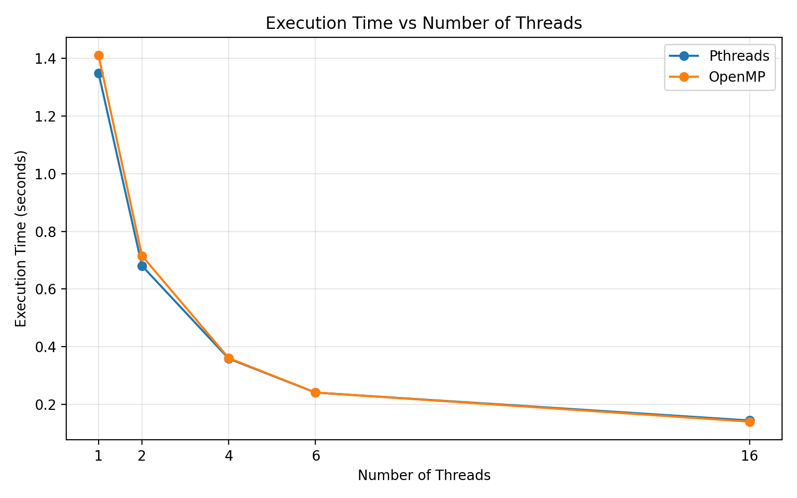
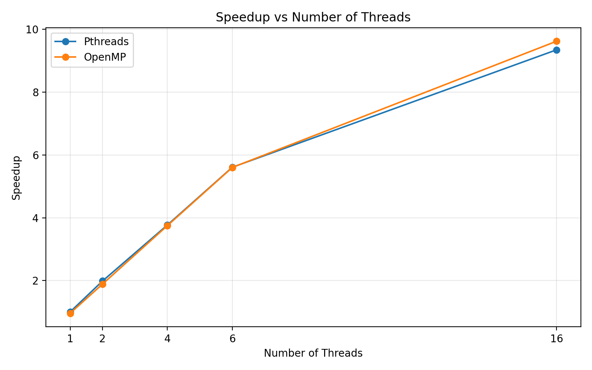
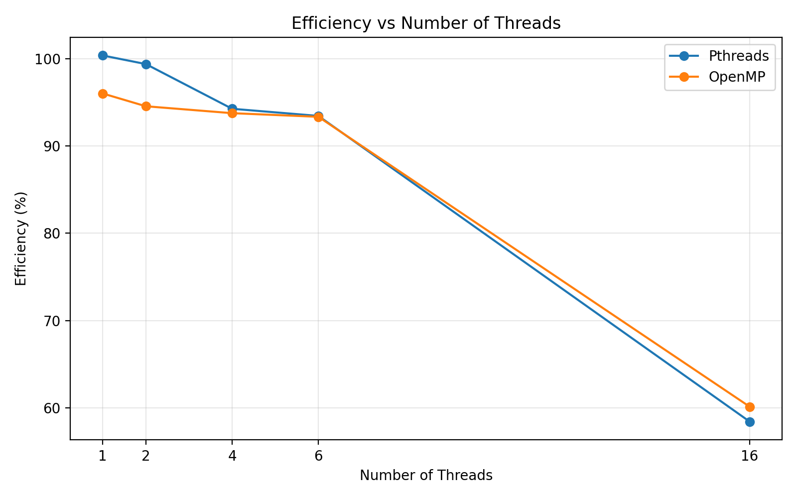
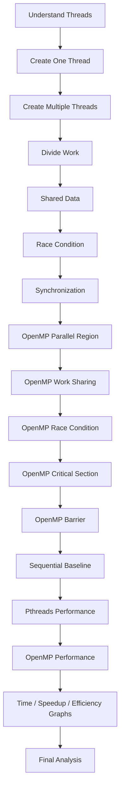

<div align="center">

# ⚡ Multithreaded Programming with Pthreads & OpenMP

### Thread creation · Management · Work distribution · Race conditions · Synchronization · Coordination · Performance


**PGC Experiment 02 — Develop Multithreaded Programs Using Parallel Programming Libraries**

</div>

---

## 📑 Table of Contents

1. [Aim](#-aim)
2. [Basic Idea](#-basic-idea)
3. [Environment](#-software-environment)
4. [Repository Structure](#-repository-structure)
5. [Getting Started](#-getting-started)
6. [Part A — Pthreads](#-part-a--pthreads)
7. [Part B — OpenMP](#-part-b--openmp)
8. [Part C — Performance Analysis](#-part-c--performance-analysis)
9. [Pthreads vs OpenMP](#-pthreads-vs-openmp)
10. [Key Terms](#-key-terms)
11. [Learning Flow](#-learning-flow)
12. [Conclusion](#-conclusion)

---

## 🎯 Aim

To develop multithreaded programs using **Pthreads** and **OpenMP**, and to understand:

- Thread creation
- Thread management
- Work distribution
- Race conditions
- Synchronization
- Thread coordination
- Performance improvement using multiple threads

---

## 💡 Basic Idea

A **thread** is an execution path inside a program — think of it as a *worker*.

```text
Sequential Program                Multithreaded Program

  One worker                              Program
     |                                       |
     |-- Task 1                  ------------------------------
     |-- Task 2                  |         |         |        |
     |-- Task 3               Thread 1  Thread 2  Thread 3  Thread 4
     |-- Task 4                  |         |         |        |
                                Work      Work      Work     Work
```

Several threads work on different parts of the same problem — that is **parallel programming**.

---

## 🖥️ Software Environment

| Component | Details |
|---|---|
| Operating System | Windows with **WSL Ubuntu** |
| Compiler | GCC |
| Libraries | Pthreads, OpenMP |
| Editor | Nano |
| Threads available (OpenMP default) | 32 |

---

## 📁 Repository Structure

```text
.
├── PTHREADS/
│   ├── thread1.c          # Create one thread
│   ├── thread2.c          # Create multiple threads
│   ├── thread_sum.c       # Divide work among threads
│   ├── race.c             # Race condition demo
│   ├── mutex.c            # Race condition fixed with mutex
│   └── pthread_perf.c     # Performance measurement
├── OpenMP/
│   ├── omp1.c             # Parallel region & thread IDs
│   ├── omp_sum.c          # Work sharing + reduction
│   ├── omp_race.c         # Race condition demo
│   ├── omp_critical.c     # Fixed with critical section
│   ├── omp_barrier.c      # Thread coordination
│   └── omp_perf.c         # Performance measurement
├── Performance Analysis/
│   ├── sequential.c       # Sequential baseline
│   └── graphs & results
├── graphs/                # Graphs used in this README
└── README.md
```

> 📝 Adjust file locations above if your folders are organised slightly differently.

---

## 🚀 Getting Started

```bash
# 1. Open WSL from PowerShell
wsl

# 2. Clone the repository
git clone https://github.com/chaitanya-m5/PGC-Develop-Multithreaded-Programs-Using-Parallel-Programming-Libraries-.git
cd PGC-Develop-Multithreaded-Programs-Using-Parallel-Programming-Libraries-

# 3. Check the compiler and OpenMP support
gcc --version
gcc -fopenmp --version
```

**Compile cheat-sheet**

| Library | Compile command |
|---|---|
| Pthreads | `gcc file.c -o file -pthread` |
| OpenMP | `gcc file.c -o file -fopenmp` |
| Sequential | `gcc file.c -o file` |

---

## 🧵 Part A — Pthreads

POSIX Threads give **explicit** control over threads using:
`pthread_create()` · `pthread_join()` · `pthread_mutex_lock()` · `pthread_mutex_unlock()`

### Step 1 — Create one thread (`thread1.c`)

```c
pthread_create(&thread, NULL, thread_function, NULL);  // CREATE
pthread_join(thread, NULL);                            // WAIT
```

```bash
gcc thread1.c -o thread1 -pthread && ./thread1
```
```text
Hello from the thread!
Main thread finished.
```

```text
Before pthread_create()          After pthread_create()
     Main Thread                      Program
          |                          /       \
       main()                 Main Thread   New Thread
                                   |             |
                                main()     thread_function()
```

### Step 2 — Create multiple threads (`thread2.c`)

Four threads are created in a loop, each receiving its own ID.

```text
Hello from Thread 1
Hello from Thread 2
Hello from Thread 4
Hello from Thread 3
All threads have finished.
```

> ⚠️ **Thread execution order is not guaranteed.** The OS scheduler decides it.

### Step 3 — Divide work among threads (`thread_sum.c`)

Array `{10, 20, 30, 40, 50, 60, 70, 80}` is split among 4 threads.

| Thread | Elements | Partial Sum |
|:---:|---|:---:|
| 1 | 10 + 20 | **30** |
| 2 | 30 + 40 | **70** |
| 3 | 50 + 60 | **110** |
| 4 | 70 + 80 | **150** |
| **Total** | | **360** |

### Step 4 — Race condition (`race.c`) 🐛

Four threads each do `counter++` 100,000 times on a shared variable, with no protection.

| Run | Expected | Actual |
|:---:|:---:|:---:|
| 1 | 400000 | 167739 ❌ |
| 2 | 400000 | 131342 ❌ |

**Why?** Two threads can read the same value and both write back the same result:

```text
counter = 10
Thread 1 reads 10      Thread 2 reads 10
Thread 1 writes 11     Thread 2 writes 11     → expected 12, got 11 (lost update)
```

### Step 5 — Fix with a mutex (`mutex.c`) 🔒

```c
pthread_mutex_lock(&mutex);
counter++;
pthread_mutex_unlock(&mutex);
```

| Expected | Actual |
|:---:|:---:|
| 400000 | **400000** ✅ |

---

## 🧶 Part B — OpenMP

OpenMP is a **higher-level** model based on compiler directives:
`#pragma omp parallel` · `parallel for` · `critical` · `barrier` · `reduction`

### Step 6 — Parallel region (`omp1.c`)

```c
#pragma omp parallel
{
    printf("Hello from Thread %d of %d\n", omp_get_thread_num(), omp_get_num_threads());
}
```

On the test machine OpenMP used **32 threads**:

```text
Hello from Thread 18 of 32
Hello from Thread 13 of 32
Hello from Thread 19 of 32
...
Hello from Thread 0 of 32
```

### Step 7 — Work sharing & reduction (`omp_sum.c`)

```c
#pragma omp parallel for reduction(+:total_sum)
```

- `parallel for` → loop iterations are divided among threads
- `reduction(+:total_sum)` → each thread keeps a private partial sum; OpenMP safely combines them

Result: `Total sum = 360`

### Step 8 — OpenMP race condition (`omp_race.c`) 🐛

OpenMP creates threads for you but **does not make shared data safe automatically**.

| Expected | Actual |
|:---:|:---:|
| 400000 | ~100000 ❌ (varies with timing) |

### Step 9 — Fix with `critical` (`omp_critical.c`) 🔒

```c
#pragma omp critical
{
    counter++;
}
```

| Expected | Actual |
|:---:|:---:|
| 400000 | **400000** ✅ |

### Step 10 — Barrier (`omp_barrier.c`) 🚧

```text
Thread 1 -- Stage 1 --|
Thread 2 -- Stage 1 --|
Thread 3 -- Stage 1 --|-- BARRIER
Thread 4 -- Stage 1 --|
                       v
                    Stage 2
```

Every "completed Stage 1" message appears **before** any "started Stage 2" message.

---

## 📊 Part C — Performance Analysis

**Workload:** summing `i * 0.000001` for `i = 0 … 1,000,000,000` (N = 10⁹).
Expected result: `499999999500.00`

### Sequential baseline

| Run | Time (s) |
|:---:|:---:|
| 1 | 1.353895 |
| 2 | 1.355794 |
| 3 | 1.349621 |
| 4 | 1.353422 |
| 5 | 1.353365 |
| **Average** | **1.353219** |

### Execution time

| Threads | Pthreads (s) | OpenMP (s) |
|:---:|:---:|:---:|
| 1 | 1.348142 | 1.409294 |
| 2 | 0.680737 | 0.715560 |
| 4 | 0.358872 | 0.360803 |
| 6 | 0.241345 | 0.241608 |
| 16 | 0.144812 | **0.140692** |



### Speedup

$$\text{Speedup} = \frac{T_{sequential}}{T_{parallel}}$$

| Threads | Pthreads | OpenMP |
|:---:|:---:|:---:|
| 1 | 1.004× | 0.960× |
| 2 | 1.988× | 1.891× |
| 4 | 3.771× | 3.751× |
| 6 | 5.608× | 5.601× |
| 16 | 9.345× | **9.618×** |



### Efficiency

$$\text{Efficiency} = \frac{\text{Speedup}}{\text{Number of Threads}} \times 100$$

| Threads | Pthreads | OpenMP |
|:---:|:---:|:---:|
| 1 | 100.38% | 96.02% |
| 2 | 99.39% | 94.56% |
| 4 | 94.27% | 93.76% |
| 6 | 93.45% | 93.35% |
| 16 | 58.40% | 60.11% |



### 🔍 Observations

- Execution time falls steadily as threads increase, for both libraries.
- With **16 threads**: Pthreads ≈ **9.35×**, OpenMP ≈ **9.62×** faster than sequential.
- Efficiency stays above ~93% up to 6 threads, then drops to ~60% at 16 threads.
- Pthreads and OpenMP perform almost identically on this workload — OpenMP achieves similar results with far less code.

### ❓ Why isn't 16 threads 16× faster?

Ideal time would be 1.35 / 16 ≈ **0.084 s**, but the measured OpenMP time was **0.141 s**. Real parallel programs carry overhead:

- Thread creation & management
- Scheduling
- Synchronization
- Memory access
- Operating-system activity
- Non-parallel work

> **More threads can reduce execution time, but speedup is not perfectly linear.**

---

## ⚖️ Pthreads vs OpenMP

| Concept | Pthreads | OpenMP |
|---|---|---|
| Create threads | `pthread_create()` | `#pragma omp parallel` |
| Wait for threads | `pthread_join()` | Runtime handles team completion at region end |
| Work distribution | Programmer divides work explicitly | `parallel for` distributes loop iterations |
| Protect shared data | Mutex | `critical` |
| Coordination | Join / synchronization mechanisms | `barrier` |
| Combine partial results | Programmer-managed | `reduction` |

---

## 📖 Key Terms

| Term | Meaning |
|---|---|
| **Thread** | A path of execution inside a program |
| **Main thread** | The thread that starts executing `main()` |
| **Additional thread** | A new thread created via e.g. `pthread_create()` |
| **Multithreading** | Using multiple threads within one program |
| **Parallel programming** | Dividing work so multiple execution units work concurrently |
| **Work distribution** | Splitting a large task into smaller tasks for different threads |
| **Race condition** | Unsynchronized access to shared data giving incorrect results |
| **Mutex** | Lock that protects a critical section (Pthreads) |
| **Critical section** | Code that only one thread may execute at a time |
| **Barrier** | Point where threads wait until all have arrived |
| **Speedup** | How much faster parallel is vs. the sequential baseline |
| **Efficiency** | How effectively threads convert into speedup |

---

## 🗺️ Learning Flow



---

## ✅ Conclusion

This experiment showed how multithreaded programs are built with **Pthreads** (explicit control over creation, joining and mutexes) and **OpenMP** (parallel regions, work sharing, critical sections, barriers, reductions).

- Unprotected shared data causes **race conditions**; mutexes and critical sections fix them.
- For a suitable workload, more threads **substantially reduce execution time** — about **9.6× faster** with 16 threads.
- Speedup is **sub-linear** because of parallel overhead, so efficiency drops as thread count grows.

**Complete flow:**
`Create → Manage → Divide Work → Share Data → Handle Race Conditions → Synchronize → Coordinate → Measure Performance → Analyze Results`

---

<div align="center">

Made with ☕ and threads by **[chaitanya-m5](https://github.com/chaitanya-m5)**

⭐ If you found this helpful, consider starring the repo!

</div>
